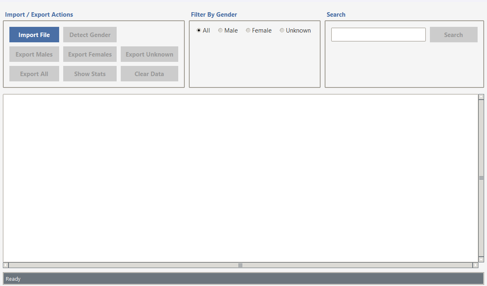
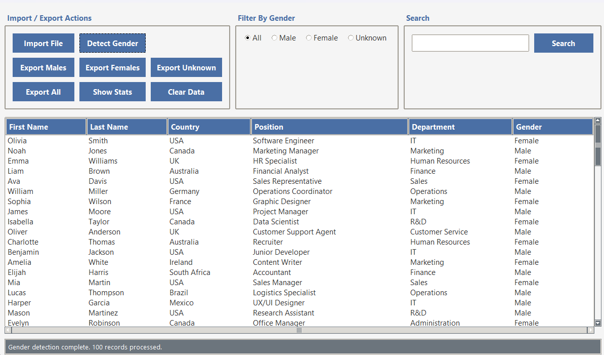

# Gender Detection GUI Application (Python + Tkinter)

This Python application provides a graphical user interface (GUI) to determine the likely gender of names using the [`gender-guesser`](https://pypi.org/project/gender-guesser/) library..

## Features

- User-friendly interface built with `tkinter`
- Gender detection based on first names
- Batch processing of names from files
- Supports `.csv` and `.xlsx` files

## Screenshots




## Requirements

- Python 3.6+
- Required packages:

```bash
pip install gender-guesser pandas openpyxl
